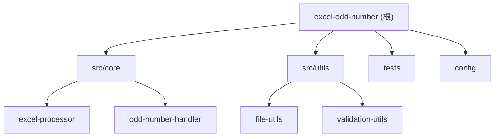

# Excel奇数处理项目

## 变更记录 (Changelog)
- **2025-09-21 14:30:00** - 添加GitHub Actions自动化构建和发布工作流
- **2025-09-20 09:21:23** - 项目初始化，创建基础架构文档

## 项目愿景
Excel奇数处理相关项目，专注于处理Excel文件中的奇数相关业务逻辑。

## 架构总览
该项目目前为空项目，建议采用以下架构：
- **核心处理模块**: 负责Excel文件读取和奇数处理逻辑
- **工具模块**: 提供通用的Excel操作工具
- **测试模块**: 确保处理逻辑的正确性
- **配置模块**: 管理项目配置和参数

## 模块结构图



## 模块索引

| 模块路径 | 状态 | 职责描述 | 主要技术 |
|---------|------|----------|----------|
| `src/core/` | 待创建 | Excel文件处理和奇数逻辑核心 | 待定 |
| `src/utils/` | 待创建 | 通用工具和辅助函数 | 待定 |
| `tests/` | 待创建 | 单元测试和集成测试 | 待定 |
| `config/` | 待创建 | 配置文件和环境设置 | 待定 |

## 运行与开发

### 推荐项目结构
```
excel-odd-number/
├── src/
│   ├── core/           # 核心业务逻辑
│   │   ├── excel-processor.js/py/ts
│   │   └── odd-number-handler.js/py/ts
│   ├── utils/          # 工具函数
│   │   ├── file-utils.js/py/ts
│   │   └── validation-utils.js/py/ts
│   └── index.js/py/ts  # 主入口文件
├── tests/              # 测试文件
│   ├── unit/
│   └── integration/
├── config/             # 配置文件
├── docs/               # 项目文档
├── examples/           # 使用示例
└── package.json/requirements.txt/go.mod  # 依赖管理
```

### 推荐技术栈选择
1. **Node.js + TypeScript**: 适合快速开发，丰富的Excel处理库（如xlsx、exceljs）
2. **Python**: 强大的数据处理能力，pandas + openpyxl组合
3. **Go**: 高性能处理大文件，静态编译便于部署

## 测试策略
- **单元测试**: 针对奇数处理逻辑的各种边界情况
- **集成测试**: 完整的Excel文件处理流程
- **性能测试**: 大文件处理性能验证
- **数据验证**: 确保处理结果的准确性

## 编码规范
- 采用一致的代码风格（ESLint/Prettier for JS/TS，Black for Python，gofmt for Go）
- 函数和变量命名清晰表达意图
- 添加必要的注释和文档字符串
- 错误处理和边界情况考虑周全

## AI 使用指引

### 开发阶段建议
1. **需求澄清**: 明确"奇数处理"的具体业务逻辑
2. **技术选型**: 根据性能要求和团队技能选择合适技术栈
3. **核心算法**: 重点关注Excel读取、奇数识别和处理逻辑
4. **错误处理**: 完善的异常处理和用户友好的错误信息

### 代码审查重点
- Excel文件格式兼容性（.xls, .xlsx）
- 内存使用优化（大文件处理）
- 数据类型验证和转换
- 并发安全（如果涉及多线程）

### 测试用例设计
- 空文件、单行、多行测试
- 包含/不包含奇数的各种场景
- 数据类型混合的情况
- 超大文件的性能测试